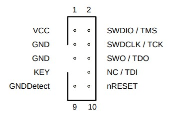
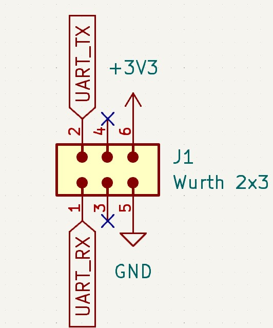

### Summary

The 2025 SAHA SAO consists of two major components: 
- [Ublox BMD 300](https://www.u-blox.com/en/product/bmd-3035-series-open-cpu)
- [TI LP55231 LED Driver](https://www.ti.com/product/LP55231)

The BMD 300 contains an [nRF52832](https://www.nordicsemi.com/Products/nRF52832) which handles LED Driver setup and the SAO proximity function.
By using an LED driver the animation of the 5 LEDs does not depend on the processor to keep the appearance smooth.
The LED driver operates completely independently of the processor with the sole exception of the proximity indicator which has its state updated periodically based on BLE scans.

The average power consumption of the SAO is 6.5 mA, giving around 30 hours of run time with a 200 mAh CR2032 coin cell battery.

INSERT PICTURES OF THE SAO HERE

The [github repo](https://github.com/ChipWizards/SAHA-SAO) contains:
- Schematics showing how the SAO is wired
- The TI assembler to build programs for the LP55231 LED Driver
- Source code for the SAO firmware

### Proximity Feature

The proximity feature works with each SAO simultaneously broadcasting and receiving beacons.
The PWM duty cycle of D1 (the soldering iron) is determined by the RSSI of received beacons.
If there are multiple beaconing SAOs being received D1 will appear to switch between multiple brightness settings, this is an intentional choice to help represent multiple beacons being received.

### Headers

There is an SWD header for flashing and debugging custom firmware that follows the SWD standard.

The SAO header in the center follows the SAO standard with the addition of TX and RX in case there are users who wish to use a carrier badge to communicate with the SAO via UART.

### Debugging

Users wanting to flash custom firmware will need a debugger to do so.
nRF prefers the JLink line of debuggers, these are going to be the most tightly integrated debuggers for this set up.
The Segger JLink Edu Mini will be the most effective.

The best places to buy these would be here:
- [Mouser](https://www.mouser.com/ProductDetail/Segger-Microcontroller/8.08.91?qs=gt1LBUVyoHmQKgW9PvZ%2FwQ%3D%3D) (Fastest)
- [Direct from Segger](https://shop-us.segger.com/product/j-link-edu-mini-8-08-91/)

It may be possible to use other SWD capable debuggers to program the SAO using OpenOCD.
These other debuggers won't be integrated into nRF's IDE (vscode) correctly but will work outside of it.

### Getting started with custom firmware

The [nRF academy](https://academy.nordicsemi.com/courses/nrf-connect-sdk-fundamentals/lessons/lesson-1-nrf-connect-sdk-introduction/) has the best documentation for setting up their SDK.
It's worth walking through Lesson 1 to set up the SDK and learn how to build examples.
Beyond Lesson 1 is a good primer for developing firmware for nRF devices but the later lessons are not required reading for tinkering with the SAO.

To load in the firmware project open the `nRF connect plugin`, select `Open an existing application` and navigate to `software/saha_sao` inside the [SAHA SAO repo](https://github.com/ChipWizards/SAHA-SAO).

Next, select `add build configuration` under the `APPLICATION` pane and select the `Build for nRF52 DK nRF52832 (build/saha_sao)` CMake preset is highlighted then select `Generate and build`.
From there it should be possible to build the project!

> **WARNING**
> `Base configuration files` should be `prj.conf`

### Writing programs for the LED Driver

The LP55231 LED Driver has 3 lighting engines which enable various lighting effects.
To write programs for the assembly engines a user will have to use the [TI Assembler from within the SAHA-SAO repo](https://github.com/ChipWizards/SAHA-SAO/tree/main/software/led_driver).

The following resources were used during SAO development to write the animations:
- [Sparkfun Guide](https://learn.sparkfun.com/tutorials/lp55231-breakout-board-hookup-guide/)
- [TI Eval Kit Guide](https://github.com/ChipWizards/SAHA-SAO/blob/main/datasheets/LP55231_EVAL_BOARD.pdf)

To bundle in the lighting program there is a global constant array name `led_program` in [src/main.c](https://github.com/ChipWizards/SAHA-SAO/blob/65f4098d620d144a2968196b77de80caab020651/software/saha_sao/src/main.c#L148).
The contents of that array are taken from the `.lst` generated by the TI assembler.

For example, the `.lst` for the default SAHA animation can be found in [software/led_driver/SAHA.lst](https://github.com/ChipWizards/SAHA-SAO/blob/main/software/led_driver/SAHA.lst).
Upon viewing this file it is clear that the current `led_program` is directly derived from the generated `.lst`.
To update the animation a user must change `led_program` to mirror their own generated `.lst` file.

The LED engine also has its own entry point and program counter so it's crucial that these are updated whenever changes to code are made.
Changes must be made to the calls to `set_engine_entry` and `set_engine_pc` within the `pled_init` function in [src/main.c](https://github.com/ChipWizards/SAHA-SAO/blob/65f4098d620d144a2968196b77de80caab020651/software/saha_sao/src/main.c#L458).
Both `set_engine_entry` and `set_engine_pc` **must** point to the first valid instruction inside of the animation program.

> **WARNING**
> It is crucial to update `led_program`, `set_engine_entry` and `set_engine_pc` whenever making changes to the animation program.